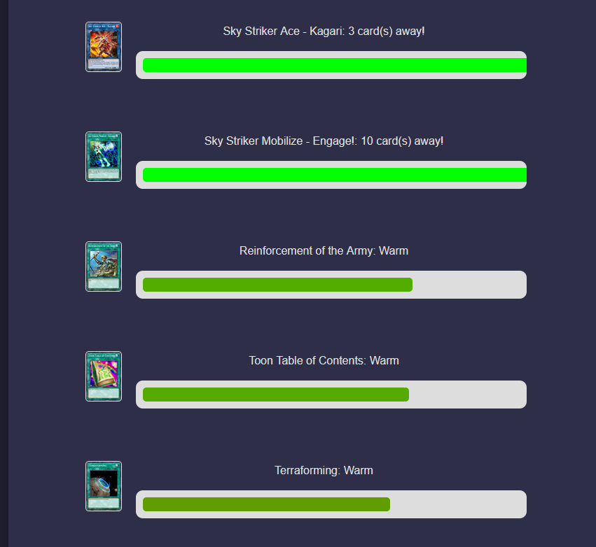

# https://ygoproximity.com

## Technical Details:
 ### The idea:
  The idea of this project was to produce a card guessing game for yu-gi-oh cards based on the online web games [proximity](https://proximity.clevergoat.com/) and [contexto](https://contexto.me/). I decided that what would be the most intuitive measure of 'closeness' would be how frequently two given cards are played together. This would mean that the more often two cards appear together the closer they would be.
  ### The network:
  The first step to this project is to produce a large information network of connections between cards and their relative closeness. In order to do this I first web scraped a large number of decks (currently around 60000). Each deck is stored as a list of card ids. Then I can go through the lists of card ids and produce a connection every time two cards appear together, the more times this happens the larger the weighting of the connection will be. During this process is when I filter out 'nonsense' decks, these are decks made by players that do not build decks with meaningful choices and is done by filtering out specific cards. In order to maintain the integrity of the network I try to only filter out decks that contain objectively terrible or anime focused cards. This graph is then used as the basis of the proximity network.\
  
  This is where I take some creativity to try and make the game more fun. Under this current model, if a card is played really frequently in general (like in the case of 'maxx "c"' and other staple cards) it will be really close to every card. This doesnt really make sense if youre trying to think about 'closeness' so I adjust the weightings of all the connections as follows in order to try and adjust the weighting to represent cards that are played together **relative** to how often they are played in general.\
  
  ### Card selection:
  now that the network has been produced I can make the actual playable game. The first step to any guessing game is to select a random answer, of course I dont just want to select any card as there is a huge number of cards people dont know, and a lot that wouldnt make fun answers. In order to maximise my chances of getting an interesting and fun answer I have to implement a more interesting way of selecting cards. I chose to use a metropolis walk for the random card selection, but I adjusted the probability function to be a quadratic in degree rather than just an inverse function.\
  
  This will cause the algorithm to be weighted towards cards that have a decent number of connections, but not too many. This means cards no one knows because they dont see play often will be less likely to be picked, and also cards that people play in everything will get selected less often. This gave the result I was looking for where cards in interesting clusters get selected most often.
  ### Running the game:
  Once the card has been selected the server then has to run the game. In order to do this I first produce a sorted list of the connections that the randomly selected card has, and adjust it accordingly in order to make the game fun and playable for users. Once sorted all of the values for closeness are then logged, this is as typically the closeness values look exponential as many people play the cards that make the most sense to play with the answer, but this will not give a linear progression for players to work with. Then the values are normalised to be between 0 and 1 so that the front end can interpret what each value means in terms of closeness and display it to the player.\
  
  The final result of this is a fun and playable guessing game for yu-gi-oh players to enjoy.